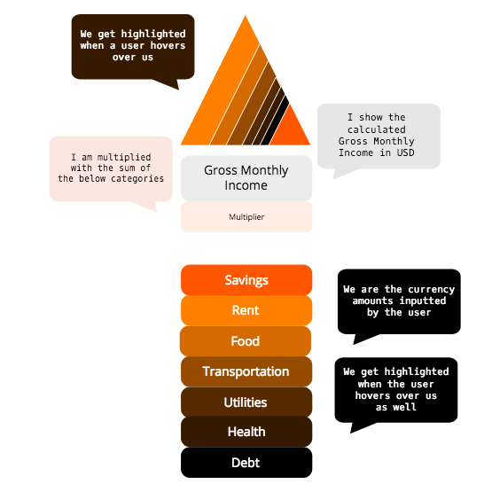
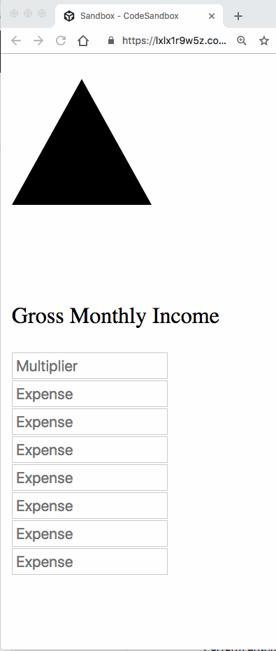

# financial-sandbox
The purpose of this repo is to try out different financial JS libraries

## Dinero.js
- docs: <a href="https://sarahdayan.github.io/dinero.js/" target="_blank">https://sarahdayan.github.io/dinero.js/</a>
- Example app from the author: https://frontstuff.io/build-a-shopping-cart-with-vue-and-dinerojs
- Unrelated calculator app which helped me think about how I wanted to handle numerical user inputs: <a href="https://github.com/ahfarmer/calculator" target="_blank">https://github.com/ahfarmer/calculator</a>
- A sick animation using triangles: <a href="https://codepen.io/FelixRilling/pen/qOZwjg" target="_blank">https://codepen.io/FelixRilling/pen/qOZwjg</a>

### React + Dinero.js
I decided to create a React app which displays examples of Dinero.js with some pleasant visuals.

Core Functionality:

- What is the most annoying task to do manually?
  - Perform arithmetic by hand
- What is the next most annoying task to do manually?
  - Update the visualization to match the arithmetic's result

Core Functionality Visual:

Core Functionality Components:

1. <strong>PersonalFinanceVisualization (cyan):</strong> contains the entirety of the app
2. <strong>TriangleDisplay (hot pink):</strong> displays triangles
3. <strong>Triangle (black):</strong> visual representation of currency amount based on user input
4. <strong>GrossMonthlyIncomeCalculator (dark green):</strong> displays all components related to Gross Monthly Income
5. <strong>GrossMonthlyIncomeDisplay (yellow):</strong> displays the Gross Monthly Income
6. <strong>MultiplierSelector (orange):</strong> receives user input
7. <strong>ExpenseTable (dark blue):</strong> contains ExpenseInput components
8. <strong>ExpenseInput (purple):</strong> receives user input

<strong>Version 1 (Static)</strong>

The first version I created was quite barebones, but allowed me to wrap my head around how the components above would translate to code. I also got a chance to play around with the attributes of the `polygon` element:

<strong>Version 2 (with state)</strong>

The two pieces of data that can change over time and cannot be calculated by any other props are:

1. Expenses (user input values)
2. Multiplier (user input value)

The Triangle renders an SVG based on the value of an Expense, while the GrossMonthlyIncomeDisplay renders the product of the Multiplier and the sum of Expenses as text. The common parent (or rather, grandparent) for these two components is the PersonalFinanceVisualization component, so it will hold the state.

